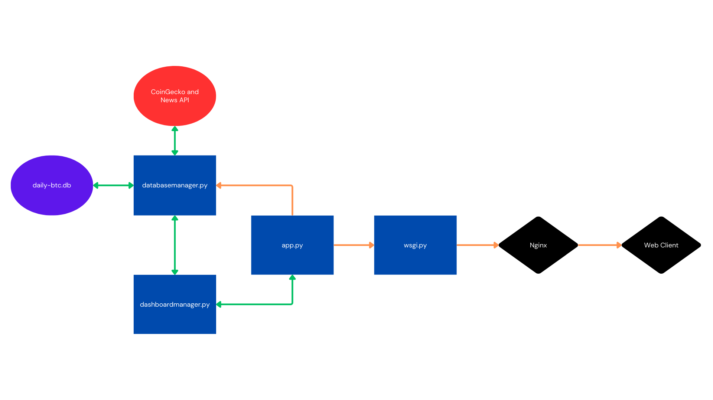

# Purpose
The purpose of this program is to host a webpage that showcases daily price actions and news for Bitcoin.

# Implementation

Above is a diagram of the system. Here is an overview of its operations:
<ol>
    <li>daily-btc.db:
        <ul>
            <li>A SQLite database to store data in the long-term from CoinGecko and News API calls.</li>
            <li>Built on top of the SQLAlchemy ORM for flexibility.</li>
        </ul>
    <li>databasemanager.py: 
        <ul>
            <li>A manager to oversee the database in performing ETL, CRUD and similar operations.</li>
            <li>Provides data for the Dashboard Manager
        </ul>
    <li>dashboardmanager.py:
        <ul>
            <li>A manager to oversee the dashboard in performing updates, rendering layouts and similar operations.</li>
            <li>Performs Sentiment Analysis using Hugging Face's Twitter-RoBERTa model to determine what is classified as "major" news.</li>
            <li>Built on Dash, HTML and CSS(Bootstrap).</li>
        </ul>
    </li>
    <li>server.py: A server to oversee managers and web clients' requests.</li>
</ol>

# Results
The Daily BTC: [INSERT WEBPAGE LINK]

By going to the webpage above, a user can get a quick update on recent price actions and major news for Bitcoin.

Here are some areas for improvement:
<ol>
    <li>API Rates: The website is updated once per hour because of the APIs' free plans limitations. For more granularity and frequency, APIs' paid plans are required.</li>
    <li>Machine Learning:</li>
    <ul>
        <li>Sentiment analysis is performed on each new's title and description because the new's content, in the News API free plan, is often incomplete.</li>
        <li>Economic charts can benefit from, say, a linear regression model to determine whether or not Bitcoin is "Bullish" or "Bearish" for the current day.</li>
    </ul>
    </li>
</ol>
